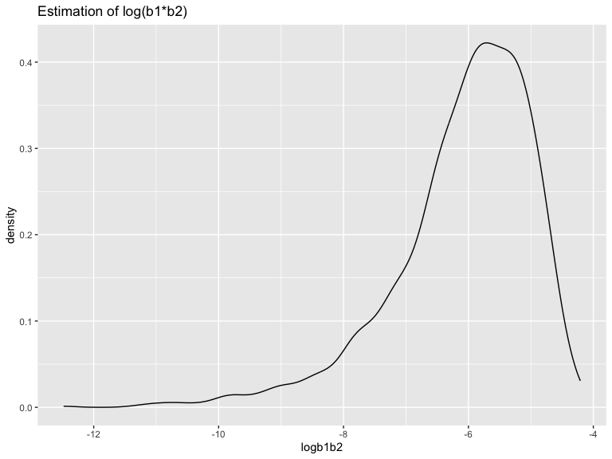
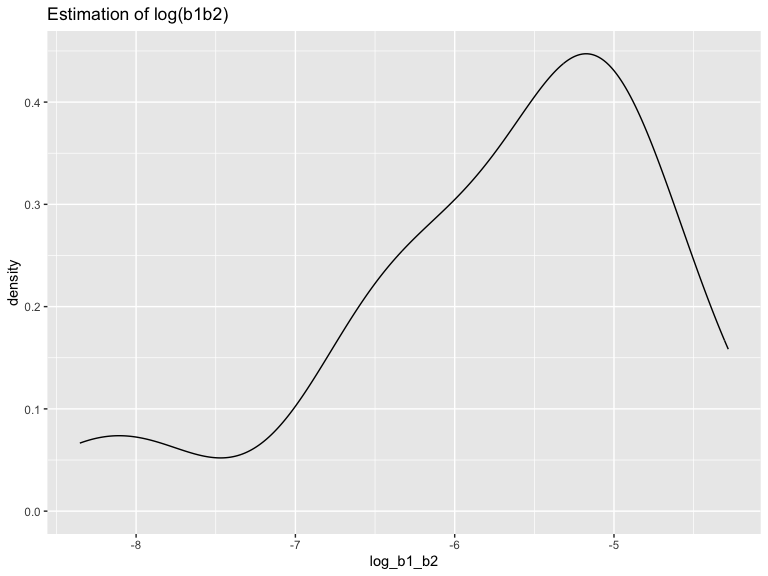

P8105 Homework 6
================
Laylah Jones
2023-12-02

# Problem 1

# Problem 2

### Loading the Data

``` r
weather_df = 
  rnoaa::meteo_pull_monitors(
    c("USW00094728"),
    var = c("PRCP", "TMIN", "TMAX"), 
    date_min = "2022-01-01",
    date_max = "2022-12-31") |>
  mutate(
    name = recode(id, USW00094728 = "CentralPark_NY"),
    tmin = tmin / 10,
    tmax = tmax / 10) |>
  select(name, id, everything())
```

    ## using cached file: /Users/laylahjones/Library/Caches/org.R-project.R/R/rnoaa/noaa_ghcnd/USW00094728.dly

    ## date created (size, mb): 2023-09-28 10:44:43.434266 (8.524)

    ## file min/max dates: 1869-01-01 / 2023-09-30

### Creating Bootstrap and Getting Estimates

``` r
weather_data = 
  weather_df |> 
  modelr::bootstrap(n = 50) |> 
  mutate(
    models = map(strap, \(df) lm(tmax ~ tmin + prcp, data = df)),
    r2 = map(models, broom::glance),
    results = map(models, broom::tidy)) |>
  select(.id,results,r2) |> 
  unnest(r2, results) |>
  select(.id, r.squared, term, estimate) |>
  pivot_wider(
    names_from = term,
    values_from = estimate
  ) |>
  mutate(
    log_b1_b2 = log(tmin * prcp)
  ) |>
  select(.id, r.squared, log_b1_b2)
```

    ## Warning: `unnest()` has a new interface. See `?unnest` for details.
    ## ℹ Try `df %>% unnest(c(r2, results))`, with `mutate()` if needed.

    ## Warning: There was 1 warning in `mutate()`.
    ## ℹ In argument: `log_b1_b2 = log(tmin * prcp)`.
    ## Caused by warning in `log()`:
    ## ! NaNs produced

### Plotting Distribution of Estimates

``` r
weather_data |>
  ggplot(aes(x = r.squared)) +
  geom_density() +
  labs(
    title = "Estimation of R Squared",
    x = "R Squared Estimate",
    y = "Count"
  )
```



The distribution of ${r^2}$ is normal, with it being centered around
0.920. It shows a visibly heavy tail extending to low values, and a bump
which could be attributed to the occurrence of large outliers withing
the bootstrap samples.

``` r
weather_data |>
  ggplot(aes(x = log_b1_b2)) +
  geom_density() + 
  labs(
    title = "Estimation of log(b1b2)"
  )
```

    ## Warning: Removed 29 rows containing non-finite values (`stat_density()`).



The distribution of log($\hat{beta_1} * \hat{beta_2}$) is uni-modal and
left-skewed. There are 58 NA values, due to negative precipitation
values, and we can see this distribution after we remove the NA values.
The distribution shows an even more visibly heavy tail extending to the
low values, with majority of the values clustering on the right side.

### 95% CI for log(b1\*b2)

``` r
quantile(
  pull(weather_data, log_b1_b2),
  probs = c(0.025, 0.975), 
  na.rm = TRUE
) |> 
  knitr::kable()
```

|       |         x |
|:------|----------:|
| 2.5%  | -8.117436 |
| 97.5% | -4.436341 |

This is the 95% confidence interval for
log($\hat{beta_1} * \hat{beta_2}$) after removing the NA values.

### 95% CI for R-Squared

``` r
quantile(
  pull(weather_data, r.squared),
  probs = c(0.025, 0.975)
) |> 
  knitr::kable()
```

|       |         x |
|:------|----------:|
| 2.5%  | 0.8899967 |
| 97.5% | 0.9345209 |

# Problem 3

### Loading the data

``` r
birthweight_df = 
  read_csv("data/birthweight.csv") |> 
  janitor::clean_names() 
```
