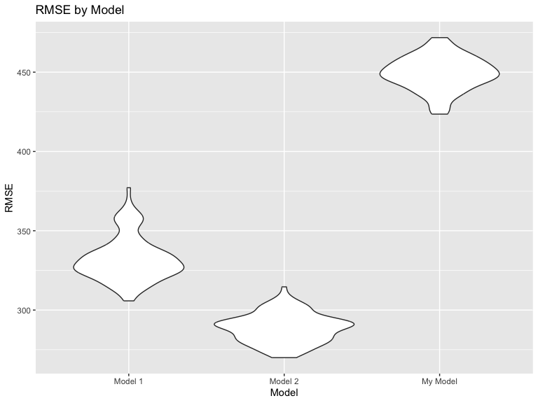

P8105 Homework 6
================
Laylah Jones
2023-12-02

# Problem 2

### Loading the Data

``` r
weather_df = 
  rnoaa::meteo_pull_monitors(
    c("USW00094728"),
    var = c("PRCP", "TMIN", "TMAX"), 
    date_min = "2022-01-01",
    date_max = "2022-12-31") |>
  mutate(
    name = recode(id, USW00094728 = "CentralPark_NY"),
    tmin = tmin / 10,
    tmax = tmax / 10) |>
  select(name, id, everything())
```

    ## using cached file: /Users/laylahjones/Library/Caches/org.R-project.R/R/rnoaa/noaa_ghcnd/USW00094728.dly

    ## date created (size, mb): 2023-09-28 10:44:43.434266 (8.524)

    ## file min/max dates: 1869-01-01 / 2023-09-30

### Creating Bootstrap and Getting Estimates

``` r
boot_sample = function(df) {
  sample_frac(df, replace = TRUE)
}
```

``` r
set.seed(1)

boot_strap = 
  tibble(strap_number = 1:5000) |> 
  mutate(
    strap_sample = map(strap_number, \(i) boot_sample(weather_df))
  )
```

``` r
boot_results = 
  boot_strap |> 
  mutate(
    models = map(strap_sample, \(df) lm(tmax ~ tmin + prcp, data = df)),
    tidy_results = map(models, broom::tidy),
    glance_results = map(models, broom::glance)
  ) |> 
  select(strap_number, tidy_results, glance_results) |> 
  unnest(tidy_results, glance_results)
```

    ## Warning: `unnest()` has a new interface. See `?unnest` for details.
    ## ℹ Try `df %>% unnest(c(tidy_results, glance_results))`, with `mutate()` if
    ##   needed.

``` r
logb1b2_results = boot_results |> 
  select(strap_number, term, estimate, std.error) |> 
  filter(term %in% c("tmin","prcp")) |> 
  pivot_wider(
     names_from = term,
     values_from = c(estimate, std.error)
  ) |> 
  mutate(
    logb1b2 = log(estimate_tmin * estimate_prcp)
  ) 
```

    ## Warning: There was 1 warning in `mutate()`.
    ## ℹ In argument: `logb1b2 = log(estimate_tmin * estimate_prcp)`.
    ## Caused by warning in `log()`:
    ## ! NaNs produced

``` r
rsq_results = boot_results |> 
  select(strap_number, r.squared) |> 
  distinct(.keep_all = TRUE)
```

### Plotting Distribution of Estimates

``` r
logb1b2_results |> 
  ggplot(aes(x = logb1b2)) + 
  geom_density() +
  labs(
    title = "Estimation of log(b1*b2)")
```

    ## Warning: Removed 3361 rows containing non-finite values (`stat_density()`).


``` r
rsq_results |> 
  ggplot(aes(x = r.squared)) + 
  geom_density() + 
  labs(
    title = "Esimation of R squared")
```


The distribution of ${r^2}$ is normal, with it being centered around
0.920. It shows a visibly heavy tail extending to low values, and a bump
which could be attributed to the occurrence of large outliers withing
the bootstrap samples.

The distribution of log($\hat{beta_1} * \hat{beta_2}$) is normal and
left-skewed. Due to negative precipitation values, and we can see this
distribution after we remove the NA values. The distribution shows an
even more visibly heavy tail extending to the low values, with majority
of the values clustering on the right side.

### 95% CI for log(b1\*b2)

``` r
logb1b2_results |> 
  summarise(
  upperCI = quantile(logb1b2, 0.975, na.rm = TRUE),
  lowerCI = quantile(logb1b2, 0.025, na.rm = TRUE)) |> 
  knitr::kable()
```

|   upperCI |   lowerCI |
|----------:|----------:|
| -4.601673 | -8.981559 |

This is the 95% confidence interval for
log($\hat{beta_1} * \hat{beta_2}$) after removing the NA values.

### 95% CI for R-Squared

``` r
rsq_results |> 
  summarise(
  upperCI = quantile(r.squared, 0.975, na.rm = TRUE),
  lowerCI = quantile(r.squared, 0.025, na.rm = TRUE)) |> 
  knitr::kable()
```

|   upperCI |   lowerCI |
|----------:|----------:|
| 0.9406812 | 0.8885495 |

This is the 95% confidence interval for R Squared.

# Problem 3

### Loading and Cleaning the data

``` r
birthweight_df = 
  read_csv("data/birthweight.csv") |> 
  janitor::clean_names() |> 
  mutate(
    babysex = as.factor(babysex),
    babysex = recode(babysex, "1" = "Male", "2" = "Female"),
    frace = as.factor(frace),
    frace = recode(frace, "1" = "White", "2" = "Black", "3" = "Asian", "4" = "Puerto Rican", "8" = "Other", "9" = "Unknown"),
    malform = as.factor(malform),
    malform = recode(malform, "0" = "Absent", "1" = "Present"),
    mrace = as.factor(mrace),
    mrace = recode(mrace, "1" = "White", "2" = "Black", "3" = "Asian", "4" = "Puerto Rican", "8" = "Other")
  )

head(birthweight_df)
```

    ## # A tibble: 6 × 20
    ##   babysex bhead blength   bwt delwt fincome frace gaweeks malform menarche
    ##   <fct>   <dbl>   <dbl> <dbl> <dbl>   <dbl> <fct>   <dbl> <fct>      <dbl>
    ## 1 Female     34      51  3629   177      35 White    39.9 Absent        13
    ## 2 Male       34      48  3062   156      65 Black    25.9 Absent        14
    ## 3 Female     36      50  3345   148      85 White    39.9 Absent        12
    ## 4 Male       34      52  3062   157      55 White    40   Absent        14
    ## 5 Female     34      52  3374   156       5 White    41.6 Absent        13
    ## 6 Male       33      52  3374   129      55 White    40.7 Absent        12
    ## # ℹ 10 more variables: mheight <dbl>, momage <dbl>, mrace <fct>, parity <dbl>,
    ## #   pnumlbw <dbl>, pnumsga <dbl>, ppbmi <dbl>, ppwt <dbl>, smoken <dbl>,
    ## #   wtgain <dbl>

``` r
purrr::map(birthweight_df, ~sum(is.na(.)))
```

    ## $babysex
    ## [1] 0
    ## 
    ## $bhead
    ## [1] 0
    ## 
    ## $blength
    ## [1] 0
    ## 
    ## $bwt
    ## [1] 0
    ## 
    ## $delwt
    ## [1] 0
    ## 
    ## $fincome
    ## [1] 0
    ## 
    ## $frace
    ## [1] 0
    ## 
    ## $gaweeks
    ## [1] 0
    ## 
    ## $malform
    ## [1] 0
    ## 
    ## $menarche
    ## [1] 0
    ## 
    ## $mheight
    ## [1] 0
    ## 
    ## $momage
    ## [1] 0
    ## 
    ## $mrace
    ## [1] 0
    ## 
    ## $parity
    ## [1] 0
    ## 
    ## $pnumlbw
    ## [1] 0
    ## 
    ## $pnumsga
    ## [1] 0
    ## 
    ## $ppbmi
    ## [1] 0
    ## 
    ## $ppwt
    ## [1] 0
    ## 
    ## $smoken
    ## [1] 0
    ## 
    ## $wtgain
    ## [1] 0

Using the \`purrr::map(birthweight_df, ~sum(is.na(.))), we found that
there is no missing data.

### Making the Regression Model

``` r
model_1 = lm(bwt ~ babysex + fincome + gaweeks + malform + smoken + wtgain, data = birthweight_df)

model_1
```

    ## 
    ## Call:
    ## lm(formula = bwt ~ babysex + fincome + gaweeks + malform + smoken + 
    ##     wtgain, data = birthweight_df)
    ## 
    ## Coefficients:
    ##    (Intercept)   babysexFemale         fincome         gaweeks  malformPresent  
    ##       474.8052        -90.4794          2.4426         61.0335          0.7492  
    ##         smoken          wtgain  
    ##        -7.3697          9.0620

My regression model consists of the variables `babysex`, `fincome`,
`gaweeks`, `malform`, `smoken`, and `wtgain`. From this, I hypothesize
that these specific variables underly birthweight.

### Plot of Regression Model

``` r
birthweight_plot =
birthweight_df |> 
  modelr::add_predictions(model_1) |>  
  modelr::add_residuals(model_1) |>  
  ggplot(aes(x = pred, y = resid)) +
  geom_point(alpha = .2) +
  labs(
    x = "Fitted Values",
    y = "Residuals",
    title = "Residuals vs Fitted Values"
  )

birthweight_plot
```


I used this code above to create a plot of the model residuals fitted
against values from the proposed model.

### Cross Validation

``` r
set.seed(1)

cross_validation = 
  crossv_mc(birthweight_df, 100) |>
  mutate(
    train = map(train, as_tibble),
    test = map(test, as_tibble)) |> 
  mutate(
    model_1 = map(.x = train, ~lm(bwt ~ blength + gaweeks, data = .x)),
    model_2 = map(.x = train, ~lm(bwt ~ bhead * blength * babysex, data = .x)),
    my_model = map(.x = train, ~lm(bwt ~ babysex + fincome + gaweeks + malform + smoken + wtgain, data = .x))
  ) |> 
  mutate(
    rmse_model_1 = map2_dbl(.x = model_1, .y = test, ~rmse(model = .x, data = .y)),
    rmse_model_2 = map2_dbl(.x = model_2, .y = test, ~rmse(model = .x, data = .y)),
    rmse_my_model = map2_dbl(.x = my_model, .y = test, ~rmse(model = .x, data = .y))
  )

cross_validation
```

    ## # A tibble: 100 × 9
    ##    train    test     .id   model_1 model_2 my_model rmse_model_1 rmse_model_2
    ##    <list>   <list>   <chr> <list>  <list>  <list>          <dbl>        <dbl>
    ##  1 <tibble> <tibble> 001   <lm>    <lm>    <lm>             360.         302.
    ##  2 <tibble> <tibble> 002   <lm>    <lm>    <lm>             322.         280.
    ##  3 <tibble> <tibble> 003   <lm>    <lm>    <lm>             307.         279.
    ##  4 <tibble> <tibble> 004   <lm>    <lm>    <lm>             337.         298.
    ##  5 <tibble> <tibble> 005   <lm>    <lm>    <lm>             367.         303.
    ##  6 <tibble> <tibble> 006   <lm>    <lm>    <lm>             314.         282.
    ##  7 <tibble> <tibble> 007   <lm>    <lm>    <lm>             357.         290.
    ##  8 <tibble> <tibble> 008   <lm>    <lm>    <lm>             346.         301.
    ##  9 <tibble> <tibble> 009   <lm>    <lm>    <lm>             327.         287.
    ## 10 <tibble> <tibble> 010   <lm>    <lm>    <lm>             338.         292.
    ## # ℹ 90 more rows
    ## # ℹ 1 more variable: rmse_my_model <dbl>

``` r
cross_validation_plot =
 cross_validation |>  
  select(starts_with("rmse")) |>  
  pivot_longer(
    everything(),
    names_to = "model",
    values_to = "rmse",
    names_prefix = "rmse_"
  ) |>  
  mutate(
    model = recode(model, "model_1" = "Model 1", "model_2" = "Model 2", "my_model" = "My Model")
  ) |>  
  ggplot(aes(
    x = model, 
    y = rmse)) +
  geom_violin() +
  labs(
    x = "Model",
    y = "RMSE",
    title = "RMSE by Model"
  )

cross_validation_plot
```



From the plot above, we can see that Model 2, which consists of head
circumference, length, sex, and all interactions, had the lowest RMSE
out of all the models including the proposed model. Model 1, which
consists of length and gestational age, has an RMSE that is greater than
the one seen in Model 2, but less than that of the proposed model. From
this it can be indicated that the proposed model is the most suitable
model compared to all the other models.
